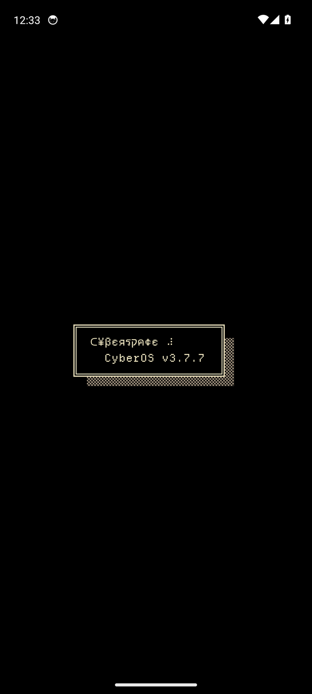
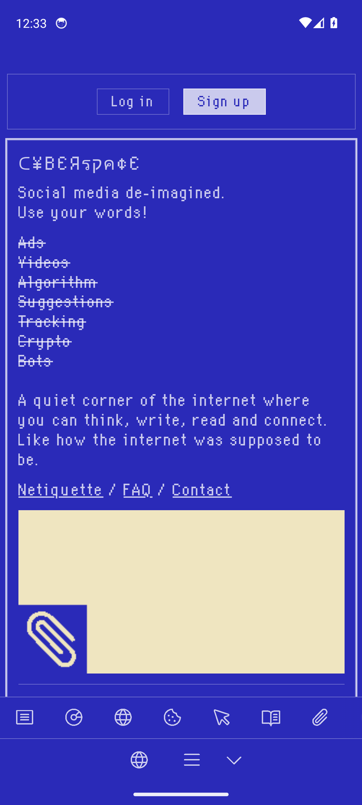
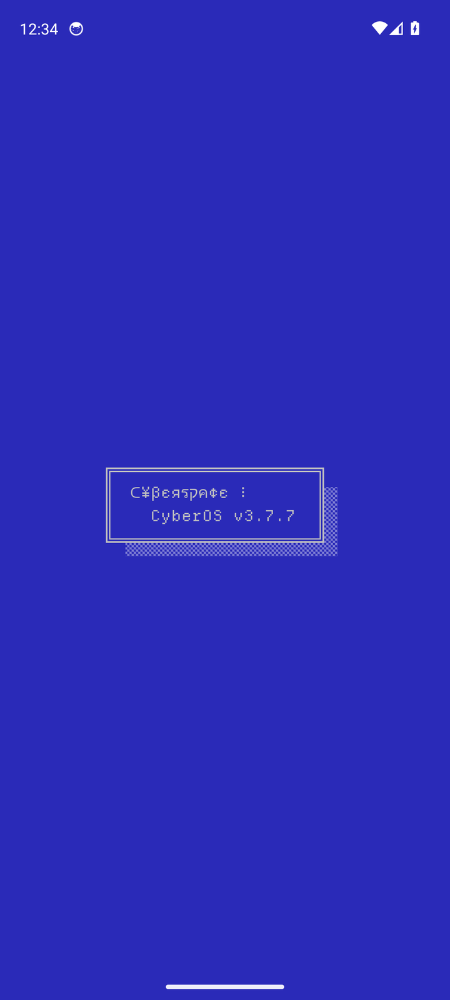

<p align="center">
  
</p>

<h1 align="center">Cyberspace for Android</h1>

<p align="center">
  An unofficial Android app for <a href="https://cyberspace.online">Cyberspace</a>, the text-only social network.
</p>

<p align="center">
  <a href="https://github.com/IamAndelib/CyberSpace/releases/latest"></a>
  <a href="https://github.com/IamAndelib/CyberSpace/releases"></a>
  <a href="LICENSE"></a>
  <a href="NOTICE.md"></a>
</p>

---

## Contents

- [About Cyberspace](#about-cyberspace)
- [Features](#features)
- [Download](#download)
- [Install](#install)
- [Requirements](#requirements)
- [Permissions](#permissions)
- [Verify your download](#verify-your-download)
- [Screenshots](#screenshots)
- [Updating](#updating)
- [Building from source](#building-from-source)
- [Maintaining](#maintaining)
- [FAQ](#faq)
- [Credits](#credits)
- [Disclaimer](#disclaimer)
- [License](#license)

## About Cyberspace

[Cyberspace](https://cyberspace.online) calls itself **"Social media de-imagined."** It is a quiet, text-only social network in the style of an old-school BBS, with IRC-like channels and ASCII art.

- No AI
- No algorithm
- No ads
- No tracking
- No videos or reels

Cyberspace is made by an independent solo developer, and it has been covered by PC Gamer and Hackaday.

This repository holds a lightweight, open-source Android app for the site, built from the source in [`android/`](android). It opens [cyberspace.online](https://cyberspace.online) fullscreen, and Cyberspace links open directly in the app. Your account and data live on Cyberspace's servers, not in this app.

## Features

- **Works on any Android 7.0+ phone.** The app has its own built-in web view, so you don't need a particular browser.
- **Every Cyberspace theme works.** The app never injects styles into the site, so Dark, C64, VT320, Matrix, Crypt and the rest look exactly as they do in a browser. The status and navigation bars follow the active theme's colour.
- **Fullscreen**, with no address bar or browser buttons.
- **Stays signed in** between launches.
- **Uploads** through Android's file picker, and **fullscreen video** for the jukebox.
- **Cyberspace links open in the app.** Links to other sites open in your browser.
- **Back button** goes back through pages, the way a browser does.
- **Polished icon and splash screen**, including an Android 13+ themed (monochrome) icon.

Web push notifications aren't supported, because those need a full browser.

## Download

<p align="center">
  <a href="https://github.com/IamAndelib/CyberSpace/releases/latest"><strong>Download the latest release</strong></a>
</p>

| Version | Date | File | Size | Notes |
| --- | --- | --- | --- | --- |
| **1.1** | 2026-10-05 | [`Cyberspace-v1.1.apk`](releases/Cyberspace-v1.1.apk) | ~426 KB | Latest. Built from source, works on any Android 7.0+ |
| 1.0 | 2026-10-05 | [`Cyberspace-v1.0.apk`](releases/Cyberspace-v1.0.apk) | ~195 KB | Legacy. Themes only partly apply |

Each APK has a matching checksum file next to it, for example [`Cyberspace-v1.1.apk.sha256`](releases/Cyberspace-v1.1.apk.sha256).

## Install

1. Download `Cyberspace-v1.1.apk` on your Android device.
2. Open the file. If Android blocks the install, allow your browser or file manager to **install unknown apps** when prompted. On older Android versions this setting is called **Unknown sources** and is under *Settings > Security*.
3. Tap **Install**, then open **Cyberspace**.

> [!NOTE]
> **Google Play Protect** may warn you because the app does not come from the Play Store. If you have [verified your download](#verify-your-download), you can choose to install it anyway.

> [!IMPORTANT]
> **Coming from v1.0?** Version 1.1 is a new app with a new package name and signing key, so it installs *next to* v1.0 instead of replacing it. Install v1.1, sign in, then uninstall the old one. From v1.1 on, every release is signed with the same key (see [Verify your download](#verify-your-download)), so future updates install straight over it.

## Requirements

| | |
| --- | --- |
| **Android version** | Android 7.0 (API 24) or newer |
| **Target** | Android 15 (API 35) |
| **Package name** | `io.github.iamandelib.cyberspace` |
| **Network** | An internet connection, since the app loads the Cyberspace site |

## Permissions

| Permission | Why it is needed |
| --- | --- |
| `INTERNET` | Load the Cyberspace site |
| `ACCESS_NETWORK_STATE` | Detect whether you are connected |

That's all. The app asks for no storage, location, contacts or notification permissions.

## Verify your download

### Checksum

The SHA-256 checksum of `Cyberspace-v1.1.apk` is:

```text
848387b6480d51175da36d8a9cb06f86f22f4cdf1ae33e896de1cf7d91fe4b37
```

Put the APK and its `.sha256` file in the same folder, then run:

**Linux**

```sh
sha256sum -c Cyberspace-v1.1.apk.sha256
```

**macOS**

```sh
shasum -a 256 -c Cyberspace-v1.1.apk.sha256
```

Both commands should print `Cyberspace-v1.1.apk: OK`.

**Windows (PowerShell)**

```powershell
(Get-FileHash .\Cyberspace-v1.1.apk -Algorithm SHA256).Hash -eq '848387b6480d51175da36d8a9cb06f86f22f4cdf1ae33e896de1cf7d91fe4b37'
```

This should print `True`.

### Signing certificate

From v1.1 on, releases are signed with this certificate (SHA-256 fingerprint):

```text
C3:C4:23:D5:42:74:B1:01:96:24:EB:4C:49:24:07:6A:31:CA:AC:6B:E7:9E:87:4C:2B:34:B3:35:7B:99:72:42
```

v1.0 was signed with a different certificate (`48:C8:A2:27:…:67:EB:A8`).

Check it with `apksigner` from the Android SDK build-tools:

```sh
apksigner verify --print-certs Cyberspace-v1.1.apk
```

Or with `keytool`, which comes with the JDK:

```sh
keytool -printcert -jarfile Cyberspace-v1.1.apk
```

The SHA-256 value in the output should match the fingerprint above.

## Screenshots

**In the app** (captured on an Android emulator by the CI test):

<table>
  <tr>
    <td align="center"><br><sub>Starting up</sub></td>
    <td align="center"><br><sub>C64 theme, status bar to match</sub></td>
    <td align="center"><br><sub>Theme kept after a restart</sub></td>
  </tr>
</table>

**Around the site:**

<table>
  <tr>
    <td align="center"><br><sub>Home</sub></td>
    <td align="center"><br><sub>Navigation menu</sub></td>
    <td align="center"><br><sub>Fortune</sub></td>
  </tr>
  <tr>
    <td align="center"><br><sub>Wiki</sub></td>
    <td align="center"><br><sub>RTFM / FAQ</sub></td>
    <td align="center"><br><sub>Globe</sub></td>
  </tr>
</table>

Cyberspace comes with a set of retro themes (shown here: C64, VT320, Crypt and Bubblegum):

<p align="center">
  
</p>

<sub>Screens show the Cyberspace site at a phone screen size, logged out, as the app displays it fullscreen. Content belongs to Cyberspace and its users.</sub>

## Updating

1. Download the new APK from the [latest release](https://github.com/IamAndelib/CyberSpace/releases/latest).
2. [Verify it](#verify-your-download).
3. Install it over the existing app. You do not need to uninstall first.

Because your account and data live on Cyberspace's servers, updating the app does not affect them. To be told about new versions, use GitHub's **Watch > Custom > Releases** on this repository.

## Building from source

The app's source is in [`android/`](android): one Kotlin activity around Android's WebView, plus the icon and splash resources. To build it you need JDK 17 and the Android SDK.

```sh
cd android
./gradlew assembleRelease   # unsigned unless KEYSTORE_FILE etc. are set
./gradlew assembleDebug     # debug build you can install directly
```

The icons are generated by [`tools/render_icons.py`](tools/render_icons.py) (needs Pillow):

```sh
python3 tools/render_icons.py
```

The [Android workflow](.github/workflows/android.yml) builds both APKs on every change to `android/`. It also runs an emulator test against the live site: it switches to the C64 theme, then checks that the screen really turns blue and stays blue after the app restarts.

## Maintaining

To publish a new version:

1. Bump `versionCode` and `versionName` in [`android/app/build.gradle.kts`](android/app/build.gradle.kts).
2. Build a release APK signed with the release key, and save it as `releases/Cyberspace-vX.Y.apk`. The release build signs itself when these environment variables are set: `KEYSTORE_FILE`, `KEYSTORE_PASSWORD`, `KEY_ALIAS`, `KEY_PASSWORD` (and `KEYSTORE_TYPE`, default `PKCS12`).
3. Add its checksum file next to it:
   ```sh
   cd releases
   sha256sum Cyberspace-vX.Y.apk > Cyberspace-vX.Y.apk.sha256
   ```
4. Add a `## [X.Y] - YYYY-MM-DD` entry to [CHANGELOG.md](CHANGELOG.md), plus a link reference for it at the bottom.
5. Commit, then open **Actions > Release > Run workflow** and enter the version (for example `X.Y`). The workflow creates the `vX.Y` tag for you. Pushing a `vX.Y` tag yourself works too.

The workflow checks that the APK and its `.sha256` file exist and match, takes the release notes from that version's CHANGELOG entry, and publishes a GitHub Release marked as latest with both files attached.

> [!WARNING]
> Every future APK **must be signed with the same release key** (fingerprint above). Keep the keystore and its password backed up somewhere safe. Otherwise Android will refuse to install it as an update, and users would have to uninstall the app first.

## FAQ

**Is this the official Cyberspace app?**
No. It is an unofficial app and is not affiliated with Cyberspace or its developer. See [NOTICE.md](NOTICE.md).

**Does the app collect my data?**
The app itself adds no tracking or analytics. Everything you do goes to [cyberspace.online](https://cyberspace.online) and is covered by Cyberspace's own policies.

**Where is my account stored?**
On Cyberspace's servers. The app only opens the site, so uninstalling it does not delete your account.

## Credits

- **[Cyberspace](https://cyberspace.online)** and its creator, for the platform, the name and the logo.
- **[IamAndelib](https://github.com/IamAndelib)**, for the Android app and its maintenance.

## Disclaimer

This is an unofficial project. It is not affiliated with, endorsed by, or sponsored by Cyberspace or its developer. The Cyberspace name, logo and content belong to their respective owners. See [NOTICE.md](NOTICE.md) for details.

## License

The original files in this repository (the app's source code, documentation, workflows and packaging) are released under the [MIT License](LICENSE). The license does not cover Cyberspace's content, name, logo or other trademarks. See [NOTICE.md](NOTICE.md).
