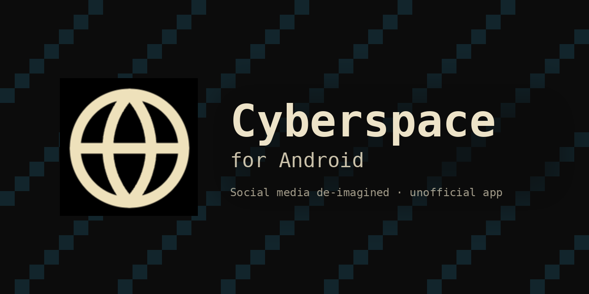
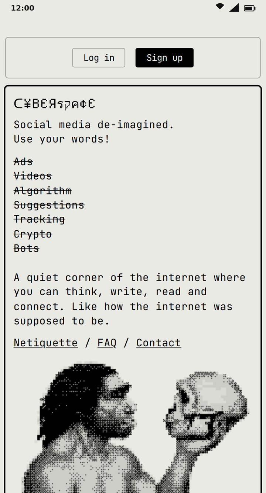
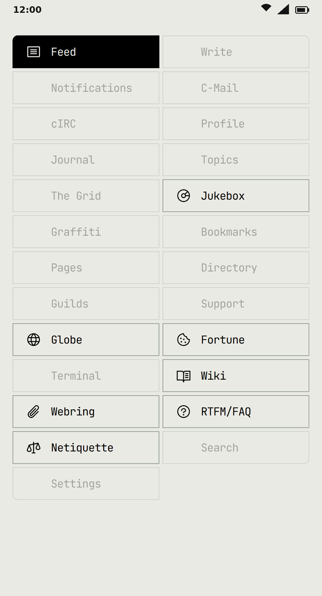
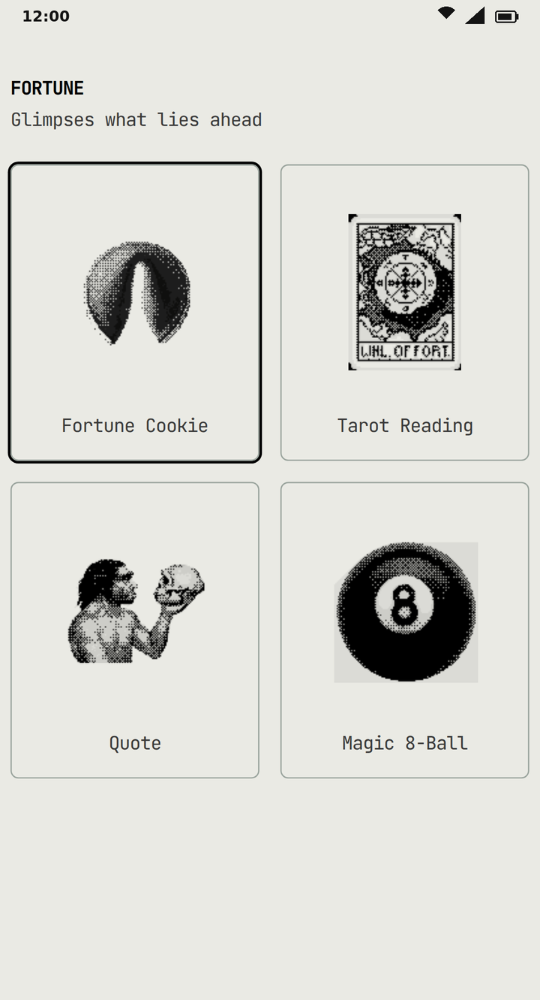
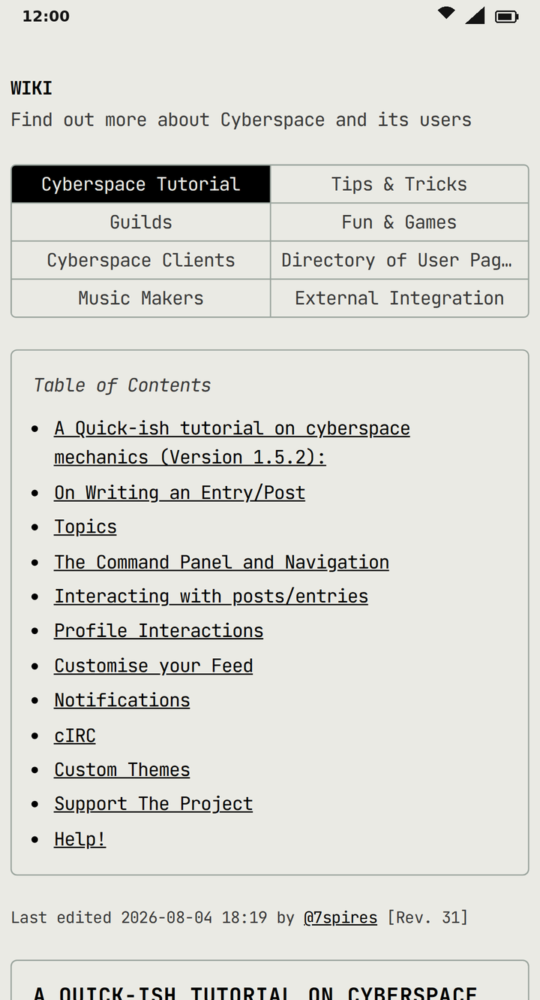
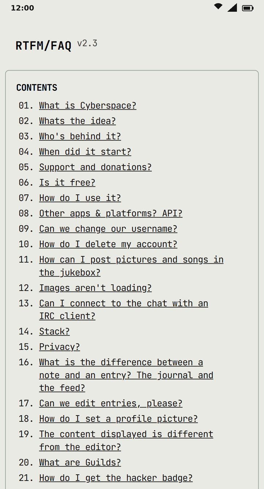
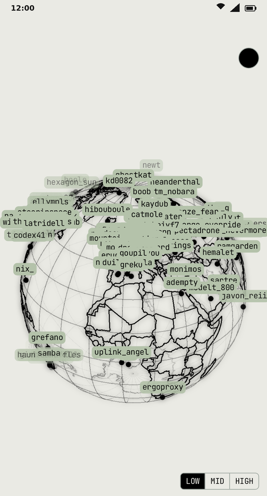
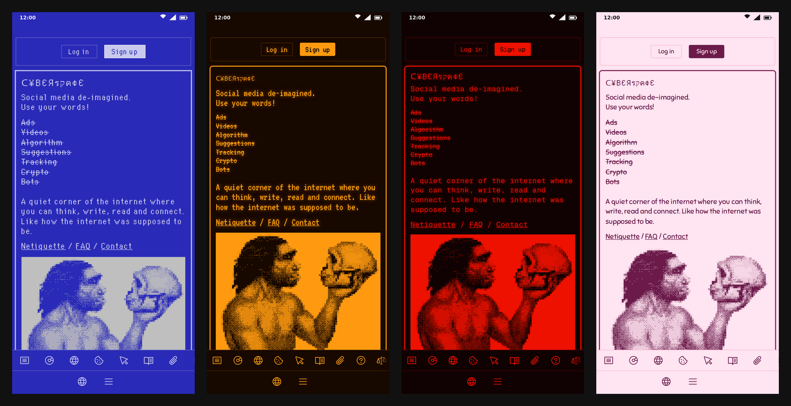

<p align="center">
  
</p>

<h1 align="center">Cyberspace for Android</h1>

<p align="center">
  An unofficial Android app for <a href="https://cyberspace.online">Cyberspace</a>, the text-only social network.
</p>

<p align="center">
  <a href="https://github.com/IamAndelib/CyberSpace/releases/latest"></a>
  <a href="https://github.com/IamAndelib/CyberSpace/releases"></a>
  <a href="LICENSE"></a>
  <a href="NOTICE.md"></a>
</p>

---

## Contents

- [About Cyberspace](#about-cyberspace)
- [Download](#download)
- [Install](#install)
- [Requirements](#requirements)
- [Permissions](#permissions)
- [Verify your download](#verify-your-download)
- [Screenshots](#screenshots)
- [Updating](#updating)
- [Maintaining](#maintaining)
- [FAQ](#faq)
- [Credits](#credits)
- [Disclaimer](#disclaimer)
- [License](#license)

## About Cyberspace

[Cyberspace](https://cyberspace.online) calls itself **"Social media de-imagined."** It is a quiet, text-only social network in the style of an old-school BBS, with IRC-like channels and ASCII art.

- No AI
- No algorithm
- No ads
- No tracking
- No videos or reels

Cyberspace is made by an independent solo developer, and it has been covered by PC Gamer and Hackaday.

This repository hosts a lightweight Android app that wraps the site. It opens [beta.cyberspace.online](https://beta.cyberspace.online) fullscreen, and Cyberspace links open directly in the app. Your account and data live on Cyberspace's servers, not in this app.

## Download

<p align="center">
  <a href="https://github.com/IamAndelib/CyberSpace/releases/latest"><strong>Download the latest release</strong></a>
</p>

| Version | Date | File | Size |
| --- | --- | --- | --- |
| 1.0 | 2026-10-05 | [`Cyberspace-v1.0.apk`](releases/Cyberspace-v1.0.apk) | ~195 KB (199,250 bytes) |

Each APK has a matching checksum file next to it, for example [`Cyberspace-v1.0.apk.sha256`](releases/Cyberspace-v1.0.apk.sha256).

## Install

1. Download `Cyberspace-v1.0.apk` on your Android device.
2. Open the file. If Android blocks the install, allow your browser or file manager to **install unknown apps** when prompted. On older Android versions this setting is called **Unknown sources** and is under *Settings > Security*.
3. Tap **Install**, then open **Cyberspace**.

> [!NOTE]
> **Google Play Protect** may warn you because the app does not come from the Play Store. If you have [verified your download](#verify-your-download), you can choose to install it anyway.

> [!IMPORTANT]
> Android only installs an update over an existing app if both are signed with the **same key**. Every release in this repository is signed with the certificate listed under [Verify your download](#verify-your-download).

## Requirements

| | |
| --- | --- |
| **Android version** | Android 5.0 (API 21) or newer |
| **Target** | Android 14 (API 34) |
| **Package name** | `online.cyberspace.twa` |
| **Network** | An internet connection, since the app loads the Cyberspace site |

## Permissions

| Permission | Why it is needed |
| --- | --- |
| `INTERNET` | Load the Cyberspace site |
| `ACCESS_NETWORK_STATE` | Detect whether you are connected |
| `POST_NOTIFICATIONS` | Show notifications (Android 13 and newer) |
| `WRITE_EXTERNAL_STORAGE` | Save downloads (only requested on Android 12L / API 32 and older) |

## Verify your download

### Checksum

The SHA-256 checksum of `Cyberspace-v1.0.apk` is:

```text
9d21b3fd7bb9ddb9a8bdb4370704fca1c60fb0793d3f22e66ccb6782502448da
```

Put the APK and its `.sha256` file in the same folder, then run:

**Linux**

```sh
sha256sum -c Cyberspace-v1.0.apk.sha256
```

**macOS**

```sh
shasum -a 256 -c Cyberspace-v1.0.apk.sha256
```

Both commands should print `Cyberspace-v1.0.apk: OK`.

**Windows (PowerShell)**

```powershell
(Get-FileHash .\Cyberspace-v1.0.apk -Algorithm SHA256).Hash -eq '9d21b3fd7bb9ddb9a8bdb4370704fca1c60fb0793d3f22e66ccb6782502448da'
```

This should print `True`.

### Signing certificate

The APK is signed with a certificate whose SHA-256 fingerprint is:

```text
48:C8:A2:27:1A:4F:E3:7B:1C:A9:78:CC:28:59:8A:07:95:67:1E:7F:9F:BD:AD:D5:CD:9A:A1:9D:24:67:EB:A8
```

Check it with `apksigner` from the Android SDK build-tools:

```sh
apksigner verify --print-certs Cyberspace-v1.0.apk
```

Or with `keytool`, which comes with the JDK:

```sh
keytool -printcert -jarfile Cyberspace-v1.0.apk
```

The SHA-256 value in the output should match the fingerprint above.

## Screenshots

<table>
  <tr>
    <td align="center"><br><sub>Home</sub></td>
    <td align="center"><br><sub>Navigation menu</sub></td>
    <td align="center"><br><sub>Fortune</sub></td>
  </tr>
  <tr>
    <td align="center"><br><sub>Wiki</sub></td>
    <td align="center"><br><sub>RTFM / FAQ</sub></td>
    <td align="center"><br><sub>Globe</sub></td>
  </tr>
</table>

Cyberspace comes with a set of retro themes (shown here: C64, VT320, Crypt and Bubblegum):

<p align="center">
  
</p>

<sub>Screens show <a href="https://beta.cyberspace.online">beta.cyberspace.online</a> at a phone screen size, logged out, as the app displays it fullscreen. Content belongs to Cyberspace and its users.</sub>

## Updating

1. Download the new APK from the [latest release](https://github.com/IamAndelib/CyberSpace/releases/latest).
2. [Verify it](#verify-your-download).
3. Install it over the existing app. You do not need to uninstall first.

Because your account and data live on Cyberspace's servers, updating the app does not affect them. To be told about new versions, use GitHub's **Watch > Custom > Releases** on this repository.

## Maintaining

New versions are published by the [release workflow](.github/workflows/release.yml):

1. Add the new APK as `releases/Cyberspace-vX.Y.apk`.
2. Add its checksum file next to it:
   ```sh
   cd releases
   sha256sum Cyberspace-vX.Y.apk > Cyberspace-vX.Y.apk.sha256
   ```
3. Add a `## [X.Y] - YYYY-MM-DD` entry to [CHANGELOG.md](CHANGELOG.md), plus a link reference for it at the bottom.
4. Commit, then tag and push:
   ```sh
   git tag vX.Y
   git push origin vX.Y
   ```

Alternatively, after committing, open **Actions > Release > Run workflow** and enter the version (for example `X.Y`). The workflow creates the `vX.Y` tag for you.

The workflow checks that the APK and its `.sha256` file exist and match, takes the release notes from that version's CHANGELOG entry, and publishes a GitHub Release marked as latest with both files attached.

> [!WARNING]
> Every future APK **must be signed with the same certificate** (fingerprint above). Otherwise Android will refuse to install it as an update, and users would have to uninstall the app first.

## FAQ

**Is this the official Cyberspace app?**
No. It is an unofficial app and is not affiliated with Cyberspace or its developer. See [NOTICE.md](NOTICE.md).

**Does the app collect my data?**
The app itself adds no tracking or analytics. Everything you do goes to [cyberspace.online](https://cyberspace.online) and is covered by Cyberspace's own policies.

**Where is my account stored?**
On Cyberspace's servers. The app only opens the site, so uninstalling it does not delete your account.

## Credits

- **[Cyberspace](https://cyberspace.online)** and its creator, for the platform, the name and the logo.
- **[IamAndelib](https://github.com/IamAndelib)**, for the app packaging and maintenance.

## Disclaimer

This is an unofficial project. It is not affiliated with, endorsed by, or sponsored by Cyberspace or its developer. The Cyberspace name, logo and content belong to their respective owners. See [NOTICE.md](NOTICE.md) for details.

## License

The original files in this repository (documentation, workflow and packaging) are released under the [MIT License](LICENSE). The license does not cover Cyberspace's content, name, logo or other trademarks. See [NOTICE.md](NOTICE.md).
